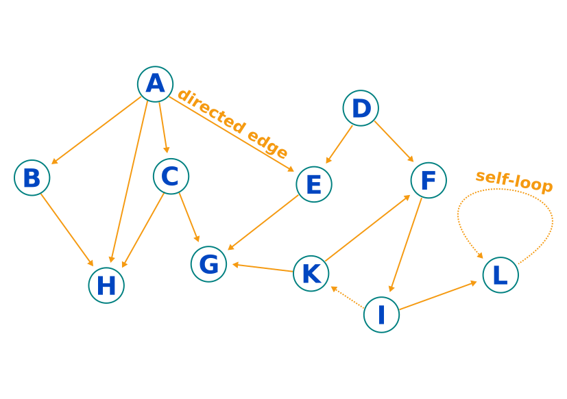

# Directed Graph

[](https://travis-ci.com/simphotonics/directed_graph)

## Introduction

An integral part of storing, manipulating, and retrieving numerical data are *data structures* or as they are called in Dart: *collections*.
Arguably the most common data structure is the *list*. It enables efficient storage and retrieval of sequential data that can be associated with an index.

A more general (non-linear) data structure where an element may be connected to one, several, or none of the other elements is called a **graph**.


Graphs are useful when keeping track of elements that are linked to or are dependent on other elements.
Examples include: network connections, links in a document pointing to other paragraphs or documents, foreign keys in a relational database, file dependencies in a build system, etc.

The package [directed_graph] contains a rudimentary implementation of a Dart graph that follows the recommendations found in [graphs-examples] and is compatible with
the algorithms provided by [graphs]. It is simple to use and includes methods that enable manipulating vertices and edges. The library provides access to algorithms
for the calculation of the *shortest path between vertices*, *detection of cycles*, or the *retrieval of a topological ordering of the graph vertices*.

## Terminology

Elements of a graph are called **vertices** (or nodes) and neighbouring vertices are connected by **edges**.
The figure below shows a **directed graph** with unidirectional edges depicted as arrows.
Graph edges are emanating from a vertex and ending at a vertex.



- **In-degree** of a vertex: Number of edges ending at this vertex. For example, vertex H has in-degree 3.
- **Out-degree** of a vertex: Number of edges starting at this vertex. For example, vertex F has out-degree 1.
- **Source**: A vertex with in-degree zero is called (local) source. Vertices A and D in the graph above are local sources.
- **Edge**: An ordered pair of connected vertices. For example, the edge (A, C) starts at vertex A and ends at vertex C.
- **Path**: A directed path is an ordered list of at least two connected vertices. The path (A, E, G) starts at vertex A and ends at vertex G.
- **Cycle**: A path that starts and ends at the same vertex. For example, a self-loop is a cycle. The dashed edges in the figure complete a cycle.
- **DAG**: An acronym for **Directed Acyclic Graph**, a directed graph without cycles.
- **Topological ordering**: An ordered list of all vertices in a graph such that vertex1 occurs before vertex2 if there is an edge pointing from vertex1 to vertex2.
A topological ordering of the graph above is: [A, D, B, C, E, K, F, G, H, I, L]. Hereby, dashed edges were disregarded since a cyclic graph does
not have a topological ordering.

**Note**: In the context of this package the definition of *edge* might be more lax compared to a rigorous mathematical definition.
For example, self-loops, that is edges connecting a vertex to itself are explicitly allowed.

For simplicity, edges are (internally) stored in a structure of type `Map<Vertex<T>, List<Vertex<T>>>` and there is nothing preventing a user from
inserting self-loops or multiple edges between the same nodes. While self-loops will render a graph cyclic, multiple entries of the same edge
do not affect the algorithms calculating a topological ordering of vertices.

## Usage

To use this library include [directed_graph] as a dependency in your pubspec.yaml file. The
example below shows how to construct a graph. The constructor takes an optional edges map as parameter.

If a comparator is specified, vertices are sorted accordingly. For more information see [comparator].

Note: To define edges starting from vertex `gray` and ending at vertices `red`, `yellow`, and `blue`, respectively,
we use vertex `gray` map *key* and vertices `[red, yellow, blue]` as map *value*.


```Dart
import 'package:directed_graph/directed_graph.dart';

var red = Vertex<String>('red');
var yellow = Vertex<String>('yellow');
var orange = Vertex<String>('orange');
var green = Vertex<String>('green');
var blue = Vertex<String>('blue');
var violet = Vertex<String>('violet');
var gray = Vertex<String>('gray');
var darkRed = Vertex<String>('darkRed');

// Function used to compare vertices.
int comparator(
  Vertex<String> vertex1,
  Vertex<String> vertex2,
) {
  return vertex1.data.compareTo(vertex2.data);
}
var graph = DirectedGraph<String>(
  {
    orange: [red, yellow],
    green: [yellow, blue],
    violet: [red, blue],
    gray: [red, yellow, blue],
  },
  comparator: comparator,
);
// To add one or several edges use:
graph.addEdges(red, [darkRed]);

// To remove one or several edges use:
graph.removeEdges(green, [blue]);

// Access (sorted) vertices:
// Note: This getter returns a non-modifiable list-view.
var vertices = graph.vertices;
```

## Examples

For further information on how to generate a topological sorting of vertices see [example].

## Features and bugs

Please file feature requests and bugs at the [issue tracker].

[comparator]: https://api.flutter.dev/flutter/dart-core/Comparator.html
[issue tracker]: https://github.com/simphotonics/directed_graph/issues
[example]: example
[graphs-examples]: https://pub.dev/packages/graphs#-example-tab-
[graphs]: https://pub.dev/packages/graphs
[directed_graph]: https://pub.dev/packages/directed_graph
