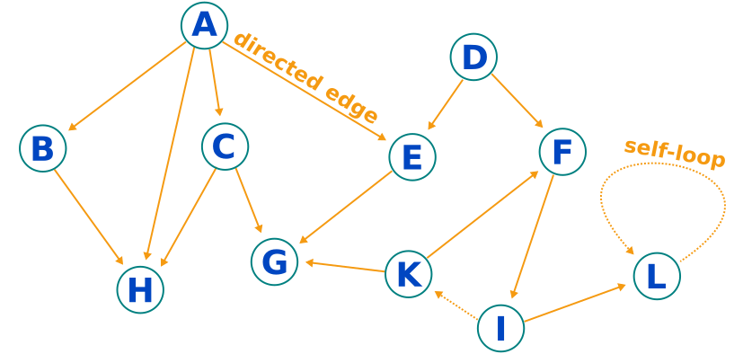

# Directed Graph

[](https://travis-ci.com/simphotonics/directed_graph)

## Introduction

An integral part of storing, manipulating, and retrieving numerical data are data structures or as they are called in Dart collections.
Arguably the most common data structure is the list. It enables efficient storage and retrieval of sequential data that can be associated with an index.

A more general (non-linear) data structure where an element may be connected to one, several, or none of the other elements is called a **graph**.


Graphs are useful when keeping track of elements that are linked to or are dependent on other elements.
Examples include: Hyperlinks in a web page that point to other pages, foreign keys in a relational database that link entries in one table to entries in another table,
include file dependencies, etc.

The package [directed_graph] contains a rudimentary implementation of a Dart graph that follows the recommendations found in [graphs-examples] and is compatible with
the algorithms provided by [graphs]. It is simple to use, includes methods that enable manipulating vertices and edges and access to algorithms
for the calculation of the shortest path between vertices, detection of cycles, or the retrieval of a topological ordering of vertices.

## Terminology

Elements of a graph are called **vertices** (or nodes) and neighbouring vertices are connected by **edges**.
The figure below shows a **directed graph** with unidirectional edges depicted as arrows.
The edges are emanating from a vertex and ending at a vertex. A self-loop is an edge that is connecting a vertex to itself.



- **Root**: A vertex with in-degree zero. Vertices A and D in the graph above are roots.
- **Edge**: A pair of vertices (vertex1, vertex2). The edge is starting at vertex1 and ends at vertex2.
- **Path**: One or more connected edges.
- **Cycle**: A path that starts and ends at the same vertex. For example, a self-loop is a cycle. The dashed edges in the figure indicate a cycle.
- **DAG**: An acronym for **Directed Acyclic Graph**, a directed graph without cycles.
- **In-degree** of a vertex: Number of edges ending at this vertex. For example, vertex H has in-degree 3.
- **Out-degree** of a vertex: Number of edges starting at this vertex. For example, vertex F has out-degree 1.
- **Topological ordering**: An ordered list of all vertices in a graph such that vertex1 occurs before vertex2 if there is an edge pointing from vertex1 to vertex2.
A topological ordering of the graph above is: [A, D, B, C, E, K, F, G, H, I, L]. Hereby, we have disregarded dashed edges as a cyclic graph does
not have a topological ordering.

## Usage

To use this library include [directed_graph] as a dependency in your pubspec.yaml file.

The example below shows how to construct a graph. The constructor takes an optional edges map as parameter.

Note: Several edges can be specified with one map entry. The key contains the vertex1 where the edges start
and the value contains a list of vertices connected to vertex1 where the edges end.

If a comparator is specified, vertices are sorted accordingly.
```Dart
var red = Vertex<String>('red');
  var yellow = Vertex<String>('yellow');
  var orange = Vertex<String>('orange');
  var green = Vertex<String>('green');
  var blue = Vertex<String>('blue');
  var violet = Vertex<String>('violet');
  var gray = Vertex<String>('gray');
  var darkRed = Vertex<String>('darkRed');

  int comparator(
    Vertex<String> vertex1,
    Vertex<String> vertex2,
  ) {
    return vertex1.data.compareTo(vertex2.data);
  }

  var graph = DirectedGraph<String>(
    {
      orange: [red, yellow],
      green: [yellow, blue],
      violet: [red, blue],
      gray: [red, yellow, blue],
    },
    comparator: comparator,
  );

  // To add one or several edges use:
  graph.addEdges(red, [darkRed]);

  // To remove one or several edges use:
  graph.removeEdges(green, [blue]);

  // Access (sorted) vertices:
  // Note: This getter returns a non-modifiable list-view.
  var vertices = graph.vertices;

```

## Examples

For further information on how to generate a topological sorting of vertices see [example].

## Features and bugs

Please file feature requests and bugs at the [issue tracker].

[issue tracker]: https://github.com/simphotonics/directed_graph/issues
[example]: example
[graphs-examples]: https://pub.dev/packages/graphs#-example-tab-
[graphs]: https://pub.dev/packages/graphs
